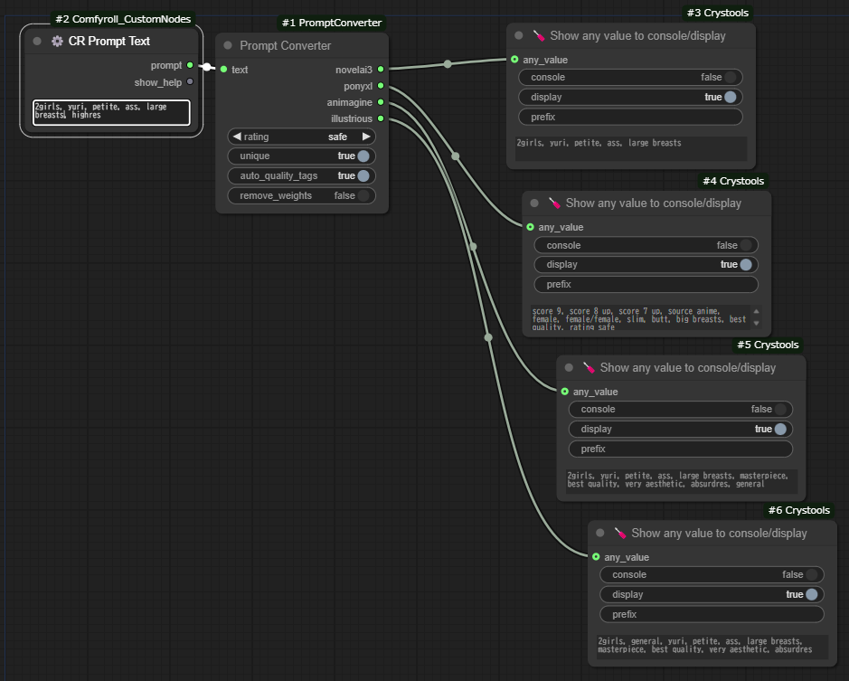

# Prompt Converter



A ComfyUI custom node that converts prompts between different AI image generation models.

## Supported Models

- NovelAI (NAI)
- PonyXL (e621 format)
- Animagine
- Illustrious

## Features

### Basic Features
- Converts tags between different formats
- Supports weight syntax conversion
- Auto quality tags for each model
- Rating tag support (safe/sensitive/questionable/explicit)
- Tag sorting based on each model's preferred order
- Duplicate tag removal option

### Advanced Filtering (with Filter Node)
Filter tags by categories:
- General tags
- Style tags
- Genre tags
- Character tags
- Other tags
- Unknown tags
- Person/Count tags
- Score tags
- Quality tags
- Rating tags
- Generation tags

### UI Extensions
- Related tag search
  - Click the search button or use Alt + - shortcut
  - Draggable popup window with category filters
  - Shows tag post counts and categories
- Tag alias support
  - Display alternative names for tags
  - Convert Japanese aliases to English tags
  - Multiple suggestions for partial matches
- Interactive UI
  - Category-based color coding
  - Hover effects for better UX
  - Keyboard shortcuts

## Installation

1. Clone this repository to your ComfyUI custom_nodes folder:
```bash
cd ComfyUI/custom_nodes
git clone https://github.com/vkff5833/ComfyUI-PromptConverter
```

2. Install required packages:
```bash
pip install -r requirements.txt
```

## Usage

### Basic Node
1. Input your prompt text in any supported format
2. Select desired rating (safe/sensitive/questionable/explicit)
3. Configure basic options:
   - Unique: Remove duplicate tags
   - Auto quality tags: Add recommended quality tags
   - Remove weights: Strip all tag weights
4. Connect outputs to your workflow

### Filter Node
Additional options for filtering specific tag types:
- Filter general/style/genre/character tags
- Filter person/count/score/quality tags
- Filter rating/generation tags
- View filtered tags in a separate output

### UI Features
- Text Selection:
  - Select text to see the search button
  - Multiple replacement suggestions for Japanese tags
- Related Tags:
  - Click the search button or use Alt + - shortcut
  - Filter tags by category in the popup
  - Click tags to add them to your prompt
- Settings:
  - Search Related Tag: Enable/disable tag search feature
  - Display Other Name: Show alternative names in search results
  - Replace Other Name: Enable tag replacement suggestions

## Version History

Current version: 1.2.1
- Added tag alias conversion feature
- Improved UI with multiple replacement suggestions
- Added settings for UI features
- Enhanced filtering capabilities
- Various bug fixes and improvements

## License

MIT License

---

# プロンプトコンバーター

異なるAI画像生成モデル間でプロンプトを変換するComfyUIカスタムノードです。

## 対応モデル

- NovelAI (NAI)
- PonyXL (e621形式)
- Animagine
- Illustrious

## 機能

### 基本機能
- 異なる形式間でのタグ変換
- 重み付け構文の変換
- モデルごとの自動品質タグ
- レーティングタグのサポート (safe/sensitive/questionable/explicit)
- モデルごとの推奨順序でのタグソート
- 重複タグの除去オプション

### 高度なフィルタリング（フィルターノード）
以下のカテゴリでタグをフィルタリング：
- 一般タグ
- 画風タグ
- ジャンルタグ
- キャラクタータグ
- その他タグ
- 不明タグ
- 人物・人数タグ
- スコアタグ
- クオリティタグ
- レーティングタグ
- 年代タグ

### UI拡張機能
- 関連タグ検索
  - 検索ボタンまたはAlt + -ショートカットで利用可能
  - ドラッグ可能なポップアップウィンドウとカテゴリフィルター
  - タグの投稿数とカテゴリを表示
- タグ別名サポート
  - タグの別名を表示
  - 日本語別名から英語タグへの変換
  - 部分一致による複数の候補表示
- インタラクティブUI
  - カテゴリ別の色分け
  - ホバーエフェクト
  - キーボードショートカット

## インストール方法

1. このリポジトリをComfyUIのcustom_nodesフォルダにクローンします:
```bash
cd ComfyUI/custom_nodes
git clone https://github.com/vkff5833/ComfyUI-PromptConverter
```

2. 必要なパッケージをインストールします:
```bash
pip install -r requirements.txt
```

## 使用方法

### 基本ノード
1. 対応形式のプロンプトテキストを入力
2. レーティングを選択 (safe/sensitive/questionable/explicit)
3. 基本オプションを設定:
   - Unique: 重複タグを削除
   - Auto quality tags: 推奨品質タグを追加
   - Remove weights: すべてのタグの重み付けを削除
4. ワークフローに出力を接続

### フィルターノード
特定のタグタイプをフィルタリングする追加オプション：
- 一般/画風/ジャンル/キャラクタータグのフィルタリング
- 人物・人数/スコア/クオリティタグのフィルタリング
- レーティング/年代タグのフィルタリング
- フィルタリングされたタグを別出力で確認可能

### UI機能
- テキスト選択:
  - テキストを選択すると検索ボタンが表示
  - 日本語タグに対する複数の置換候補を表示
- 関連タグ:
  - 検索ボタンまたはAlt + -ショートカットで利用可能
  - ポップアップでカテゴリ別にタグをフィルタリング
  - タグをクリックしてプロンプトに追加
- 設定:
  - Search Related Tag: タグ検索機能の有効/無効
  - Display Other Name: 検索結果に別名を表示
  - Replace Other Name: タグ置換候補の表示を有効化

## バージョン履歴

現在のバージョン: 1.2.1
- タグ別名変換機能を追加
- 複数の置換候補を表示するUIの改善
- UI機能の設定を追加
- フィルタリング機能の強化
- 各種バグ修正と改善

## ライセンス

MIT License
